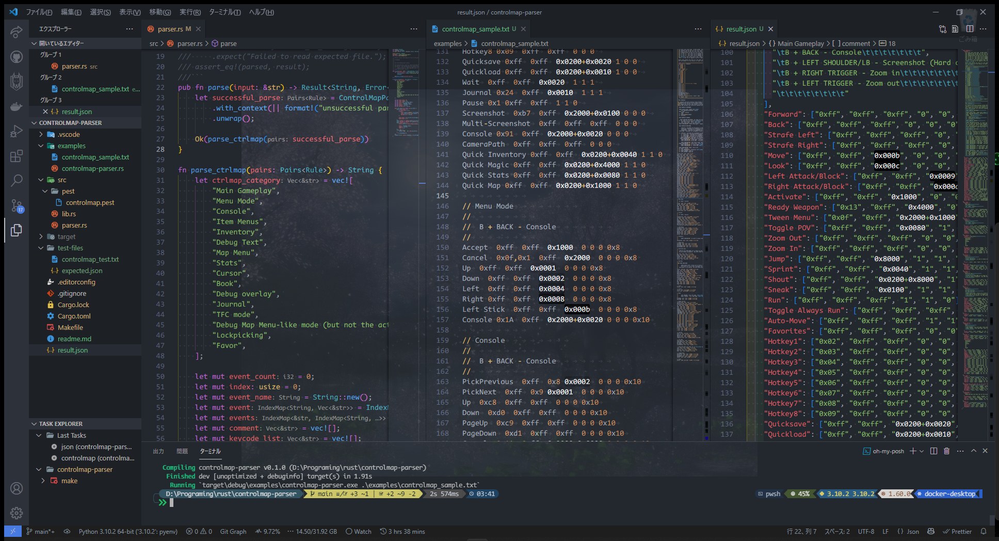

# ControlMap Parser Library

English | [日本語](docs/i18n/jp/readme.md)



## Table of Contents

- [ControlMap Parser Library](#controlmap-parser-library)
  - [Table of Contents](#table-of-contents)
  - [Abstract](#abstract)
  - [Requirements](#requirements)
  - [Getting Started](#getting-started)
  - [Known Issues](#known-issues)
  - [License](#license)

## Abstract

This is the controlmap.txt parser for Skyrim.

controlmap.txt => json file

## Requirements

- git
- Rust

## Getting Started

```bash
git clone https://github.com/SARDONYX-sard/controlmap-parser;
cd controlmap-parser;

make; # sample controlmap.txt to result.json
# or
make controlmap; # controlmap.txt to stdout (show display)

# or manual
cargo run --example controlmap-parser <your controlmap.txt file path>;
```

## Known Issues

- I cannot successfully parse the comments between the event lines in
  controlmap.txt. (They are grouped together as an array).

- json => controlmap.txt not supported.

## License

[MIT](https://opensource.org/licenses/MIT)
